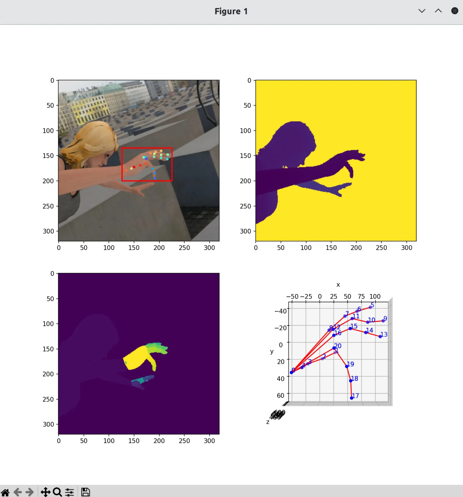
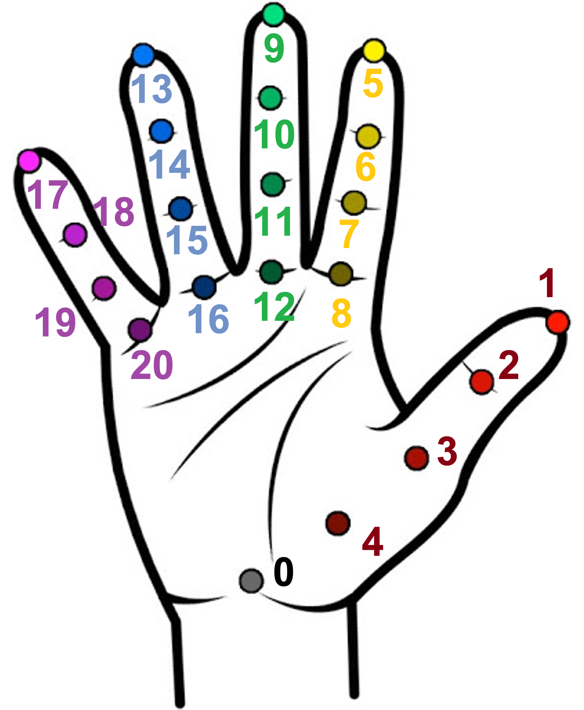
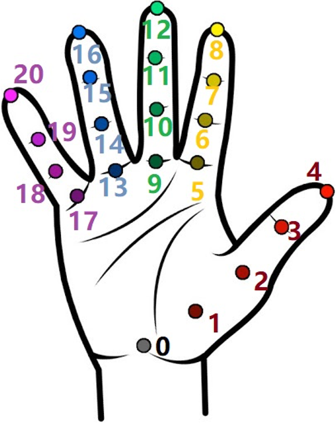
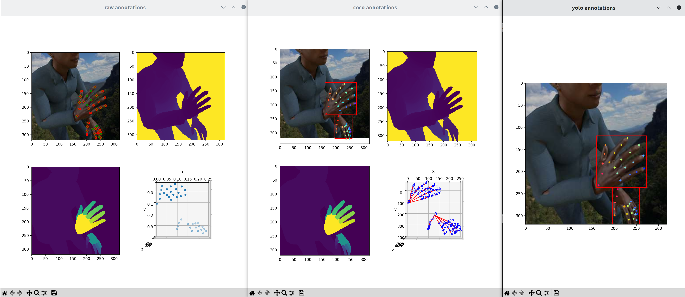
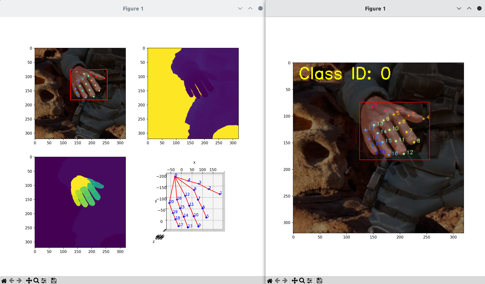
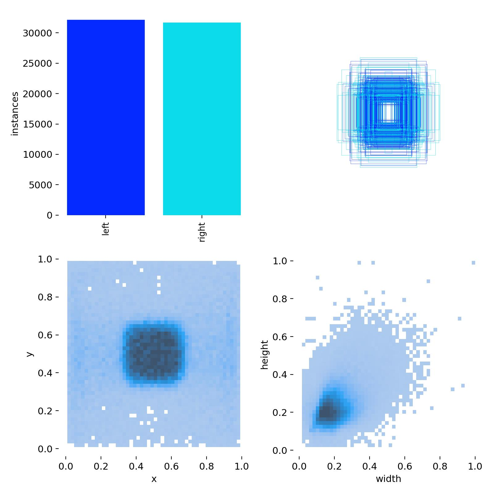
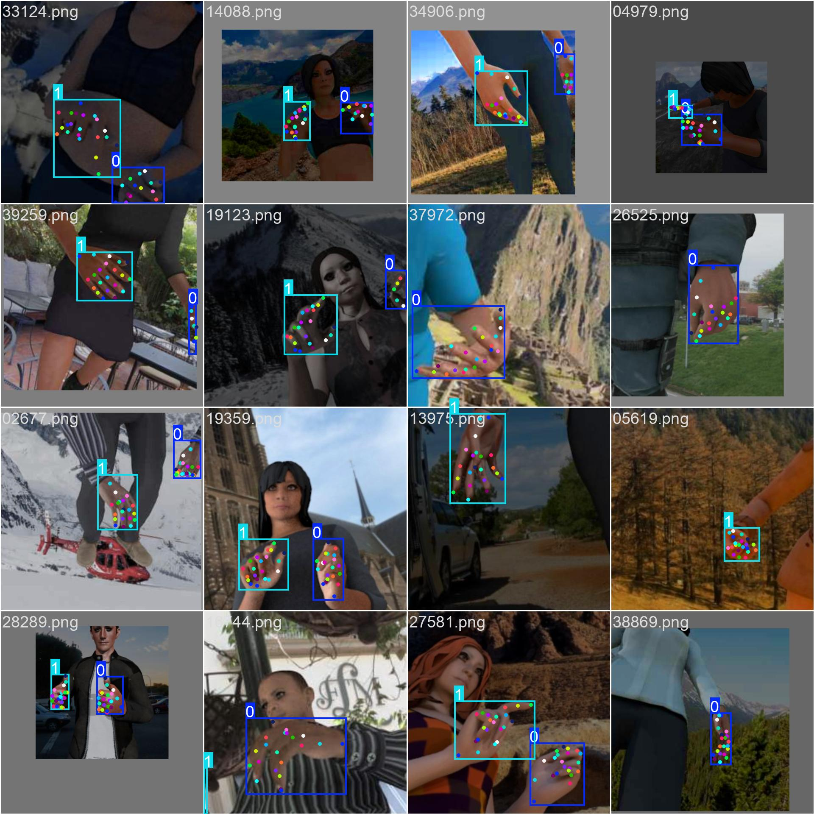

用openxlab下载带coco标注的rhd数据集：https://openxlab.org.cn/datasets/OpenDataLab/RHD_Rendered_Hand_Pose

可视化数据集后发现标注文件存在4个问题：
1. coco标注中，所有图片皆只有一个手的标注（cls+bbox+keypoint），即使原始标注（training/anno_training.pickle）中，存在带双手标注的图片；
2. coco标注中，hand关键点id定义 和 原始标注中一致。但到了coco标注中的skeleton字段，定义却变了；
3. coco标注中只有一个分类（hand），但是我需要区分左右手；
4. coco标注中，有关键点坐标值超出图片宽高范围的样本；

<p align="center">
  
</p>

原始标注中关键点id定义、coco标注中关键点顺序（左）vs coco标注中skeleton中的定义（右）：
<p align="center">
    
    
</p>
图片取自：https://github.com/open-mmlab/mmpose/blob/dev-1.x/docs/en/dataset_zoo/2d_hand_keypoint.md

我重新写了个原始标注到coco标注的转换脚本（解决了问题1、2、3），以及coco标注到yolo标注的转换脚本（解决了问题4）。还有三种标注格式的可视化脚本，以方便核查。

```shell
# 用openxlab下载coco标注的rhd数据集

# 将原始标注转换为coco标注
python convert_anno_from_raw_2_coco.py --in_path=training --out_file=./annotations_new/rhd_train.json
python convert_anno_from_raw_2_coco.py --in_path=evaluation --out_file=./annotations_new/rhd_test.json

# 可视化原始标注，按q切换到下一张图片
python view_samples_raw_anno.py --mode=training
# 可视化coco标注
python view_samples_coco_anno.py --image_dir=./ --ann_file=./annotations_new/rhd_train.json

# 将coco标注转换成yolo标注
python convert_anno_from_coco_2_yolo.py --image_path=./ --ann_file=./annotations_new/rhd_train.json --out=./yolo_format --mode=train
python convert_anno_from_coco_2_yolo.py --image_path=./ --ann_file=./annotations_new/rhd_test.json --out=./yolo_format --mode=val

# 可视化yolo标注
python view_samples_yolo_anno.py --root_dir=./yolo_format

# 训练
yolo pose train data=rhd.yaml model=yolov8n-pose.pt pretrained=True project=rhd_new_annotations name=yolov8n_pose_e100_b256_s256 epochs=100 batch=256 imgsz=256 device=0,1,2,3 fliplr=0.0
# 注意，fliplr=0.0，当hand目标检测任务中，需要区分左右手时，一定要关闭数据增强中的左右翻转
```
三种标注格式的可视化：
<p align="center">
  
</p>

openxlab的coco标注中关键点id的定义（左） vs 我的coco标注中关键点id的定义（右）：
<p align="center">
  
</p>  

wandb可视化：
<p align="center">
  
  
</p>  

### 数据集
该项目使用了由Christian Zimmermann和Thomas Brox提供的数据集，该数据集原始论文标题为《Learning to Estimate 3D Hand Pose from Single RGB Images》。根据数据集提供者的要求，这个数据集仅限于研究用途，严禁用于任何商业目的。  
请参考：https://lmb.informatik.uni-freiburg.de/resources/datasets/RenderedHandposeDataset.en.html

### 数据集引用
如果您在研究中使用了这个数据集，请引用以下论文：
```
@TechReport{zb2017hand,
  author = {Christian Zimmermann and Thomas Brox},
  title = {Learning to Estimate 3D Hand Pose from Single RGB Images},
  institution = {arXiv:1705.01389},
  year = {2017},
  note = "https://arxiv.org/abs/1705.01389",
  url = "https://lmb.informatik.uni-freiburg.de/projects/hand3d/"
}
```