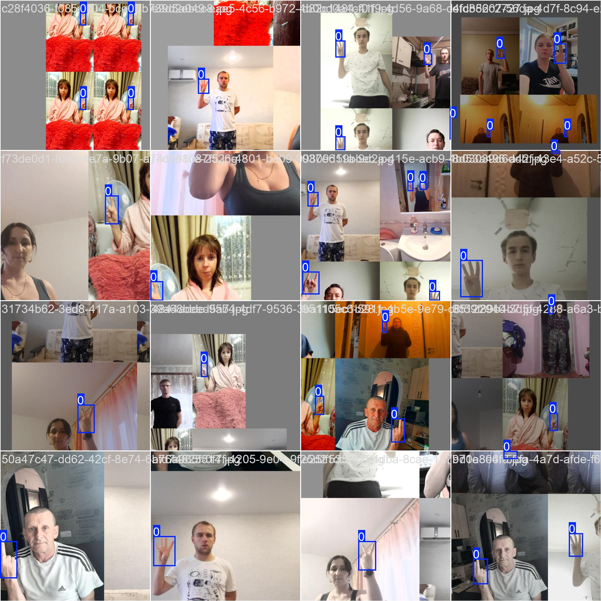

```shell
❯ cd ~/workspace/hagrid
❯ conda activate hagrid # mediapipe、ultralytics等
# -cfg=./converters/converter_config.yaml
# -out=./hagrid_coco_format
❯ python -m converters.hagrid_to_coco --mode 'hands'
# -cfg=./converters/converter_config.yaml
# -out=./hagrid_yolo_format
❯ python -m converters.hagrid_to_yolo --mode 'hands'


python yolo_annotations_viewer.py --images_path=./images/train/call --labels_path=./gesture_detection_labels/train/call --label_mode=gesture # 共34个手势可供选择

# 将标注文件中的34个手势类别，转换成1个hand类别
python convert_labels.py --input_dir=./gesture_detection_labels --output_dir=./hand_detection_labels
python yolo_annotations_viewer.py --images_path=./images/train/call --labels_path=./hand_detection_labels/train/call --label_mode=hand

yolo detect train data=hagridv2_512_hand_detection.yaml model=yolov8n.pt pretrained=True project=hagridv2_512 name=yolov8n_pretrain_e200_b256_s640 epochs=200 batch=256 imgsz=640 device=0,1,2,3

yolo detect train data=hagridv2_512_hand_detection.yaml model=yolov8m.pt pretrained=True project=hagridv2_512 name=yolov8m_e100_4b64_s640 epochs=100 batch=256 imgsz=640 device=0,1,2,3

```
yolo格式的处理：
数据集整个打包的话太大，无论上传下载都带来很多麻烦。遂将每个手势压缩的文件夹各自压缩和解压，为此准备了一个script.sh脚本
chmod +x script.sh
./script.sh compress # 压缩
./script.sh decompress # 解压

wandb可视化：
<p align="center">
  
  
</p>
<p align="center">
  
  
</p>


