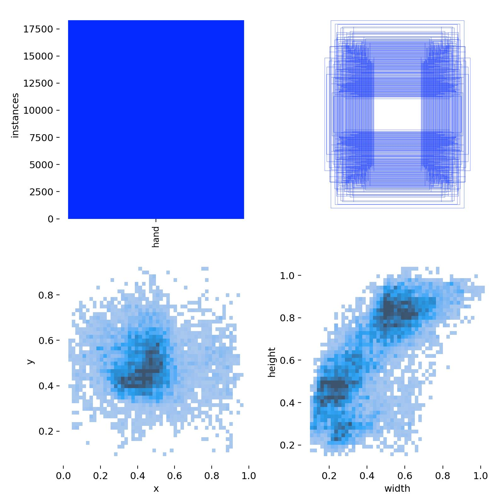
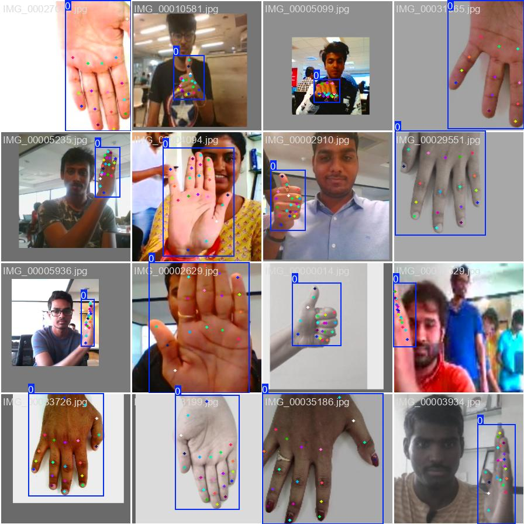
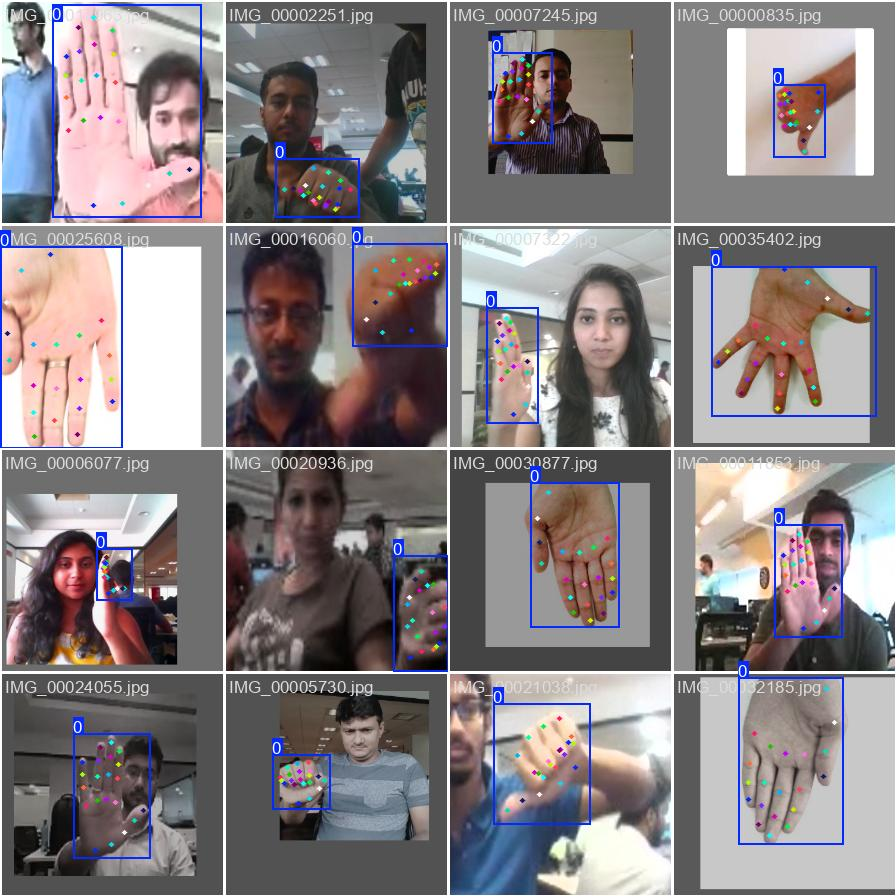

来源：https://docs.ultralytics.com/datasets/pose/hand-keypoints/  
下载：https://www.kaggle.com/datasets/riondsilva21/hand-keypoint-dataset-26k

数据集存在两个问题：
1. config.yaml中flip_idx错了；
2. 有近700个样本的标签不在规定数值范围内，yolo训练时会被抛弃。


flip_idx有何用？
flip本是yolo在数据增强时会采用的一个方法，分为flipud（上下翻转）和fliplr（左右翻转）。当遇到关键点左右对称的数据集（比如人体关键点），当左右翻转图片时，关键点也需调整，否则不仅无益，还会损害模型性能。参考：https://github.com/ultralytics/ultralytics/issues/2052

但是hand关键点并非左右对称，且该数据集只有hand一个类，不区分手性，所以图片翻转时，关键点无需调整，因此flip_idx只需保持原序即可。

有关键点uv坐标超过width、height：227  
如：hand_keypoint_dataset_26k/hand_keypoint_dataset_26k/labels/val/IMG_00001884.txt
```json
    "images": [
    {
      "id": 554,
      "license": 1,
      "file_name": "IMG_00001884.jpg",
      "height": 224,
      "width": 224,
      "date_captured": "2024-05-24T03:57:56+00:00"
    }]
    "annotations": [
    {
      "id": 554,
      "image_id": 554,
      "category_id": 1,
      "bbox": [219.5, 83.0, 31.5, 40.0],
      "area": 1260.0,
      "segmentation": [],
      "iscrowd": 0,
      "keypoints": [
        204, 113, 2, 198, 96, 2, 201, 77, 2, 210, 65, 2, 221, 59, 2, 199, 66, 2,
        215, 53, 2, 218, 60, 2, 216, 66, 2, 207, 67, 2, 224, 56, 2, 226, 63, 2,
        222, 69, 2, 217, 70, 2, 232, 59, 2, 234, 65, 2, 230, 70, 2, 227, 75, 2,
        239, 64, 2, 241, 70, 2, 238, 74, 2
      ]
    }]
```
转换成yolo归一化值后超出01范围：1.0159814357757568
```
0 0.9799107142857143 0.3705357142857143 0.28125 0.35714285714285715 ... 1.000221848487854 0.2519262433052063 2 1.0106432437896729 0.2843874990940094 2 ...
```
yolo检测到超出范围的样本后选择丢弃：
```
train: 18776 images, 0 backgrounds, 491 corrupt
WARNING .../images/train/IMG_00001070.jpg: ignoring corrupt image/label: non-normalized or out of bounds coordinates [     1.0379]
...
val: 7992 images, 0 backgrounds, 184 corrupt
WARNING .../images/val/IMG_00001884.jpg: ignoring corrupt image/label: non-normalized or out of bounds coordinates [     1.0002      1.0106      1.0375       1.046      1.0307       1.016      1.0683      1.0766      1.0667]
...
```
可以写个脚本将所有超出范围的uv坐标置为0，且可视性标签置为0（超出范围的关键点本身就应该不可见）。


wandb可视化：
<p align="center">
  
</p>
<p align="center">
  
  
</p>

### 引用和致谢  
如果您在研究或开发工作中使用手部关键点数据集，请致谢以下来源：

致谢

我们感谢以下来源提供用于此数据集的图片：

- 11k Hands
- 2000 Hand Gestures
- Gesture Recognition

这些图片是在各个平台提供的相应许可证下收集和使用的，并且按照创作共用署名-非商业性使用-相同方式共享4.0国际许可证进行分发。  
我们还要感谢这个数据集的创建者 Rion Dsilva，他对视觉AI研究的巨大贡献。